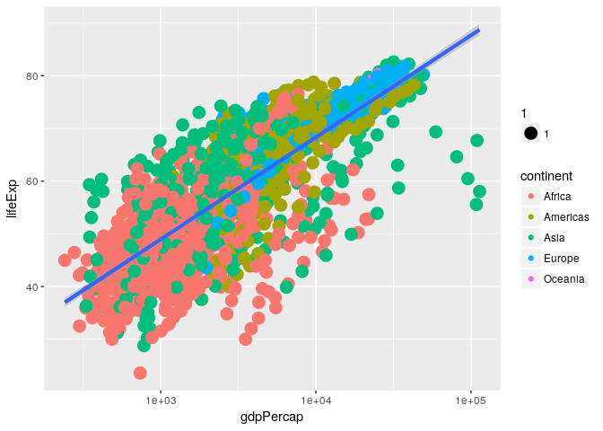

Exploring Data Frames
=====================

    cats <- read.csv(file = "feline-data.csv")
    age <- c(2,3,5,12)
    cats

    ##     coat weight likes_string
    ## 1 calico    2.1            1
    ## 2  black    5.0            0
    ## 3  tabby    3.2            1

    age <- c(4,5,8)
    cats <- cbind(cats, age)
    cats

    ##     coat weight likes_string age
    ## 1 calico    2.1            1   4
    ## 2  black    5.0            0   5
    ## 3  tabby    3.2            1   8

    newRow <- list("tortoiseshell", 3.3, TRUE, 9)
    cats <- rbind(cats, newRow)

    ## Warning in `[<-.factor`(`*tmp*`, ri, value = "tortoiseshell"): invalid
    ## factor level, NA generated

    levels(cats$coat)

    ## [1] "black"  "calico" "tabby"

    levels(cats$coat) <- c(levels(cats$coat), 'tortoiseshell')
    cats <- rbind(cats, list("tortoiseshell", 3.3, TRUE, 9))

    str(cats)

    ## 'data.frame':    5 obs. of  4 variables:
    ##  $ coat        : Factor w/ 4 levels "black","calico",..: 2 1 3 NA 4
    ##  $ weight      : num  2.1 5 3.2 3.3 3.3
    ##  $ likes_string: int  1 0 1 1 1
    ##  $ age         : num  4 5 8 9 9

    cats$coat <- as.character(cats$coat)
    str(cats)

    ## 'data.frame':    5 obs. of  4 variables:
    ##  $ coat        : chr  "calico" "black" "tabby" NA ...
    ##  $ weight      : num  2.1 5 3.2 3.3 3.3
    ##  $ likes_string: int  1 0 1 1 1
    ##  $ age         : num  4 5 8 9 9

    cats[-4,]

    ##            coat weight likes_string age
    ## 1        calico    2.1            1   4
    ## 2         black    5.0            0   5
    ## 3         tabby    3.2            1   8
    ## 5 tortoiseshell    3.3            1   9

    cats

    ##            coat weight likes_string age
    ## 1        calico    2.1            1   4
    ## 2         black    5.0            0   5
    ## 3         tabby    3.2            1   8
    ## 4          <NA>    3.3            1   9
    ## 5 tortoiseshell    3.3            1   9

    na.omit(cats)

    ##            coat weight likes_string age
    ## 1        calico    2.1            1   4
    ## 2         black    5.0            0   5
    ## 3         tabby    3.2            1   8
    ## 5 tortoiseshell    3.3            1   9

    cats <- na.omit(cats)

    cats <- rbind(cats, cats)
    cats

    ##             coat weight likes_string age
    ## 1         calico    2.1            1   4
    ## 2          black    5.0            0   5
    ## 3          tabby    3.2            1   8
    ## 5  tortoiseshell    3.3            1   9
    ## 11        calico    2.1            1   4
    ## 21         black    5.0            0   5
    ## 31         tabby    3.2            1   8
    ## 51 tortoiseshell    3.3            1   9

    rownames(cats) <- NULL
    cats

    ##            coat weight likes_string age
    ## 1        calico    2.1            1   4
    ## 2         black    5.0            0   5
    ## 3         tabby    3.2            1   8
    ## 4 tortoiseshell    3.3            1   9
    ## 5        calico    2.1            1   4
    ## 6         black    5.0            0   5
    ## 7         tabby    3.2            1   8
    ## 8 tortoiseshell    3.3            1   9

Challenge 1
-----------

    df <- data.frame(id = c('a', 'b', 'c'),
                     x = 1:3,
                     y = c(TRUE, TRUE, FALSE),
                     stringsAsFactors = FALSE)

    df <- data.frame(first = c('Antonella'),
                     last = c('Gonzalez'),
                     lucky_number = c(8),
                     stringsAsFactors = FALSE)
    df <- rbind(df, list('Marie', 'Curie', 238) )
    df <- cbind(df, coffeetime = c(TRUE,TRUE))
    df

    ##       first     last lucky_number coffeetime
    ## 1 Antonella Gonzalez            8       TRUE
    ## 2     Marie    Curie          238       TRUE

Challenge 2
-----------

    #download.file("https://raw.githubusercontent.com/swcarpentry/r-novice-gapminder/gh-pages/_episodes_rmd/data/gapminder-FiveYearData.csv", destfile = "data/gapminder-FiveYearData.csv")
    gapminder <- read.csv(file = "data/gapminder-FiveYearData.csv")

    #source(file = "scripts/load-gapminder.R")

Subsetting Data
===============

    x <- c(5.4, 6.2, 7.1, 4.8, 7.5)
    names(x) <- c('a', 'b', 'c', 'd', 'e')
    x

    ##   a   b   c   d   e 
    ## 5.4 6.2 7.1 4.8 7.5

    x[1]

    ##   a 
    ## 5.4

    x[4]

    ##   d 
    ## 4.8

    x[c(1, 3)]

    ##   a   c 
    ## 5.4 7.1

    x[1:4]

    ##   a   b   c   d 
    ## 5.4 6.2 7.1 4.8

    1:4

    ## [1] 1 2 3 4

    c(1, 2, 3, 4)

    ## [1] 1 2 3 4

    x[c(1,1,3)]

    ##   a   a   c 
    ## 5.4 5.4 7.1

    x[6]

    ## <NA> 
    ##   NA

    x[0]

    ## named numeric(0)

    x[-2]

    ##   a   c   d   e 
    ## 5.4 7.1 4.8 7.5

    x[c(-1, -5)]  # or x[-c(1,5)]

    ##   b   c   d 
    ## 6.2 7.1 4.8

Challenge 1
-----------

    x[2:4]

    ##   b   c   d 
    ## 6.2 7.1 4.8

    x[-c(1,5)]

    ##   b   c   d 
    ## 6.2 7.1 4.8

    x[c("b", "c", "d")]

    ##   b   c   d 
    ## 6.2 7.1 4.8

    x[-which(names(x) == "a")]

    ##   b   c   d   e 
    ## 6.2 7.1 4.8 7.5

    names(x) == "a"

    ## [1]  TRUE FALSE FALSE FALSE FALSE

    x[-which(names(x) %in% c("a", "c"))]

    ##   b   d   e 
    ## 6.2 4.8 7.5

Challenge 2
-----------

    x <- c(5.4, 6.2, 7.1, 4.8, 7.5)
    names(x) <- c('a', 'b', 'c', 'd', 'e')
    print(x)

    ##   a   b   c   d   e 
    ## 5.4 6.2 7.1 4.8 7.5

    x[-which(names(x) == "g")]

    ## named numeric(0)

    # A and C 

    x <- 1:3
    x

    ## [1] 1 2 3

    names(x) <- c('a', 'a', 'a')
    x

    ## a a a 
    ## 1 2 3

    names(x) == c('a', 'c')

    ## Warning in names(x) == c("a", "c"): longer object length is not a multiple
    ## of shorter object length

    ## [1]  TRUE FALSE  TRUE

    x[c(TRUE, TRUE, FALSE, FALSE)]

    ## a a 
    ## 1 2

Challenge 3
-----------

    x <- c(5.4, 6.2, 7.1, 4.8, 7.5)
    names(x) <- c('a', 'b', 'c', 'd', 'e')
    print(x)

    ##   a   b   c   d   e 
    ## 5.4 6.2 7.1 4.8 7.5

    #Write a subsetting command to return the values 4<x<7
    x_subset <- x[x<7 & x>4]
    print(x_subset)

    ##   a   b   d 
    ## 5.4 6.2 4.8

Factor subsetting

    f <- factor(c("a", "a", "b", "c", "c", "d"))
    f[f == "a"]

    ## [1] a a
    ## Levels: a b c d

    f[f %in% c("b", "c")]

    ## [1] b c c
    ## Levels: a b c d

    f[1:3]

    ## [1] a a b
    ## Levels: a b c d

    f[-3]

    ## [1] a a c c d
    ## Levels: a b c d

    #Matrix subsetting
    set.seed(1)
    m <- matrix(rnorm(6*4), ncol=4, nrow=6)
    m[3:4, c(3,1)]

    ##             [,1]       [,2]
    ## [1,]  1.12493092 -0.8356286
    ## [2,] -0.04493361  1.5952808

    m[, c(3,4)]

    ##             [,1]        [,2]
    ## [1,] -0.62124058  0.82122120
    ## [2,] -2.21469989  0.59390132
    ## [3,]  1.12493092  0.91897737
    ## [4,] -0.04493361  0.78213630
    ## [5,] -0.01619026  0.07456498
    ## [6,]  0.94383621 -1.98935170

    m[3,]

    ## [1] -0.8356286  0.5757814  1.1249309  0.9189774

    m[3, , drop=FALSE]

    ##            [,1]      [,2]     [,3]      [,4]
    ## [1,] -0.8356286 0.5757814 1.124931 0.9189774

    matrix(1:6, nrow=2, ncol=3)

    ##      [,1] [,2] [,3]
    ## [1,]    1    3    5
    ## [2,]    2    4    6

    matrix(1:6, nrow=2, ncol=3, byrow=TRUE)

    ##      [,1] [,2] [,3]
    ## [1,]    1    2    3
    ## [2,]    4    5    6

Challenge 4
-----------

    m <- matrix(1:18, nrow=3, ncol=6)
    print(m)

    ##      [,1] [,2] [,3] [,4] [,5] [,6]
    ## [1,]    1    4    7   10   13   16
    ## [2,]    2    5    8   11   14   17
    ## [3,]    3    6    9   12   15   18

    #D. m[2,c(4,5)]

List subsetting

    xlist <- list(a = "Software Carpentry", b = 1:10, data = head(iris))
    xlist[1]

    ## $a
    ## [1] "Software Carpentry"

    xlist[1:2]

    ## $a
    ## [1] "Software Carpentry"
    ## 
    ## $b
    ##  [1]  1  2  3  4  5  6  7  8  9 10

    xlist[[1]]

    ## [1] "Software Carpentry"

    xlist[["a"]]

    ## [1] "Software Carpentry"

    xlist$data

    ##   Sepal.Length Sepal.Width Petal.Length Petal.Width Species
    ## 1          5.1         3.5          1.4         0.2  setosa
    ## 2          4.9         3.0          1.4         0.2  setosa
    ## 3          4.7         3.2          1.3         0.2  setosa
    ## 4          4.6         3.1          1.5         0.2  setosa
    ## 5          5.0         3.6          1.4         0.2  setosa
    ## 6          5.4         3.9          1.7         0.4  setosa

Challenge 5
-----------

    xlist <- list(a = "Software Carpentry", b = 1:10, data = head(iris))
    xlist$b[2]

    ## [1] 2

Challenge 6
-----------

    #mod <- aov(pop ~ lifeExp, data=gapminder)
    #attributes(mod) ## `df.residual` is one of the names of `mod`
    #mod$df.residual

### data frames

    head(gapminder[3])
    head(gapminder[["lifeExp"]])
    head(gapminder$year)
    gapminder[1:3,]
    gapminder[3,]

Challenge 7
-----------

    # gapminder[gapminder$year = 1957,]
    gapminder[gapminder$year == 1957,]

    # gapminder[,-1:4]
    gapminder[,-c(1:4)]

    # gapminder[gapminder$lifeExp > 80]
    gapminder[gapminder$lifeExp > 80,]

    # gapminder[1, 4, 5]
    gapminder[1, c(4, 5)]

    # gapminder[gapminder$year == 2002 | 2007,]
     gapminder[gapminder$year == 2002 | gapminder$year == 2007,]
     gapminder[gapminder$year %in% c(2002, 2007),]

Challenge 8
-----------

Why does gapminder\[1:20\] return an error? How does it differ from
gapminder\[1:20, \]? -gapminder is a data.frame so needs to be subsetted
on two dimensions. gapminder\[1:20, \] subsets the data to give the
first 20 rows and all columns.

Create a new data.frame called gapminder\_small that only contains rows
1 through 9 and 19 through 23. You can do this in one or two steps.
gapminder\_small &lt;- gapminder\[c(1:9, 19:23),\]

Creating Publication Quality Graphics
=====================================

    library("ggplot2")
    gapminder <- read.csv(file = "gapminder.csv")
    ggplot(data = gapminder, aes(x = gdpPercap, y = lifeExp)) +
      geom_point()

    ggplot(data = gapminder, aes(x = gdpPercap, y = lifeExp))

\#\# Challenge 1

    ggplot(data = gapminder, aes(x = year, y = lifeExp)) + geom_point()

Challenge 2
-----------

    ggplot(data = gapminder, aes(x = year, y = lifeExp)) + geom_point(aes(color=continent))

Layers

    ggplot(data = gapminder, aes(x=year, y=lifeExp, by=country, color=continent)) +
      geom_line()

    ggplot(data = gapminder, aes(x=year, y=lifeExp, by=country, color=continent)) +
      geom_line() + geom_point()

    ggplot(data = gapminder, aes(x=year, y=lifeExp, by=country)) +
      geom_line(aes(color=continent)) + geom_point()

Challenge 3
-----------

    ggplot(data = gapminder, aes(x=year, y=lifeExp, by=country)) +
     geom_point() + geom_line(aes(color=continent))

    #switching the order of point and line switched which was on top 

Transformations and stats

    ggplot(data = gapminder, aes(x = gdpPercap, y = lifeExp, color=continent)) +
      geom_point()

    #fix for outliers
    ggplot(data = gapminder, aes(x = gdpPercap, y = lifeExp)) +
      geom_point(alpha = 0.5) + scale_x_log10()

    ggplot(data = gapminder, aes(x = gdpPercap, y = lifeExp)) +
      geom_point() + scale_x_log10() + geom_smooth(method="lm")

    ggplot(data = gapminder, aes(x = gdpPercap, y = lifeExp)) +
      geom_point() + scale_x_log10() + geom_smooth(method="lm", size=1.5)

\#\# Challenge 4a and 4b

    ggplot(data = gapminder, aes(x = gdpPercap, y = lifeExp)) +
      geom_point(aes(color=continent, size=1)) + scale_x_log10() + geom_smooth(method="lm", size=1.5)

    ggplot(data = gapminder, aes(x = gdpPercap, y = lifeExp)) +
      geom_point(aes(color=continent), pch=4) + scale_x_log10() + geom_smooth(method="lm", size=1.5)

multi-panel figures

    starts.with <- substr(gapminder$country, start = 1, stop = 1)
    az.countries <- gapminder[starts.with %in% c("A", "Z"), ]
    ggplot(data = az.countries, aes(x = year, y = lifeExp, color=continent)) +
      geom_line() + facet_wrap( ~ country)

    ggplot(data = az.countries, aes(x = year, y = lifeExp, color=continent)) +
      geom_line() + facet_wrap( ~ country) +
      xlab("Year") + ylab("Life expectancy") + ggtitle("Figure 1") +
      scale_colour_discrete(name="Continent") +
      theme(axis.text.x=element_blank(), axis.ticks.x=element_blank())

\#\# Challenge 5

    ggplot(data = gapminder, aes(x = gdpPercap, fill=continent)) +
     geom_density(alpha=0.6) + facet_wrap( ~ year) + scale_x_log10()

