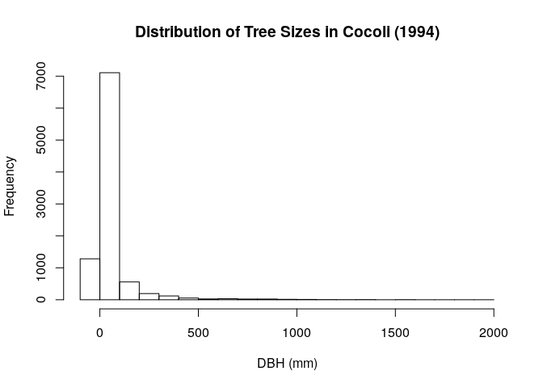
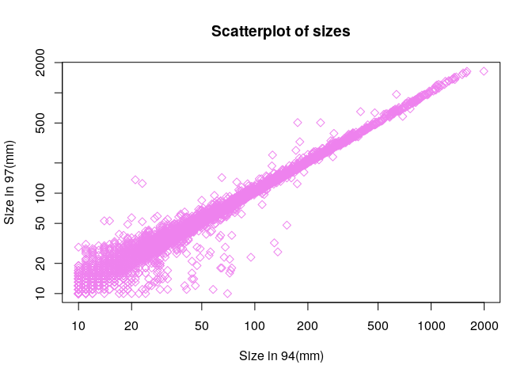

Exercise-8
==========

Reading in a file

    cocoli_dat <- read.table("/home/eeb177-student/Desktop/EEB-177/class-assignments/cocoli.txt", header = TRUE)
    #cocoli_dat <- i used a hashtag so that the knit html isnt so long

Now lets extract just one column

    #cocoli_dat
    sizes_in_94 <- cocoli_dat$dbh1
    names(sizes_in_94) <- cocoli_dat$tag #name column dbh1 using the tag column
    #names(sizes_in_94)

    sizes_in_94[1] #can use this to find certain data; in this case using the tag

    ## 000001 
    ##    171

    sizes_in_94[c("000009", "000099")]

    ## 000009 000099 
    ##     29     62

Calculate Relative Growth Rate

    sizes_in_97 <- cocoli_dat$dbh2
    rgr_1 <- (sizes_in_97 - sizes_in_94)/sizes_in_94
    #rgr_1

### Now we want to add this as a new column

    cocoli_dat$rgr_1 <- rgr_1
    head(cocoli_dat)

    ##      tag spcode   x   y dbh1 dbh2 dbh3 recr1 recr2 recr3 pom1 pom2 pom3
    ## 1 000001 PROTTE 3.0 0.9  171  267  277     A     A     A    1    2    2
    ## 2 000002 COCCPA 0.1 0.6   13   14   17     A     A     A    1    1    1
    ## 3 000003 EUGEPR 1.3 2.3   26   33   39     A     A     A    1    2    2
    ## 4 000004 PROTTE 2.2 3.4   10   17   19     A     A     A    1    1    1
    ## 5 000005 CLAVME 3.5 3.7   14   15   15     A     A     A    1    1    1
    ## 6 000006 PROTTE 4.3 4.7   12   26   25     A     A     A    1    2    2
    ##   code1 code2 code3 mult1 mult2 mult3      date1      date2      date3
    ## 1     *     *     *     1     1     1 11/02/1994 11/11/1997 11/23/1998
    ## 2     *     *     *     1     1     1 11/02/1994 11/11/1997 11/23/1998
    ## 3     M     M     M     2     2     2 11/02/1994 11/11/1997 11/23/1998
    ## 4     *     *     *     1     1     1 11/02/1994 11/11/1997 11/23/1998
    ## 5    ML    ML     M     2     2     2 11/02/1994 11/11/1997 11/23/1998
    ## 6     *     *     M     1     1     2 11/02/1994 11/11/1997 11/23/1998
    ##        rgr_1
    ## 1 0.56140351
    ## 2 0.07692308
    ## 3 0.26923077
    ## 4 0.70000000
    ## 5 0.07142857
    ## 6 1.16666667

### Plotting- GGPlot

    #bargraph- make with barplot()
    #boxplot - make with boxplot()
    #scatterplot - make with plot()
    #histogram - make with hist()

    hist(sizes_in_94, xlab = "DBH (mm)", main = "Distribution of Tree Sizes in Cocoli (1994)") #making an x label and main title

    ?hist #to get other options

    plot(x = sizes_in_94, y = sizes_in_97, main = "Scatterplot of sizes", xlab="Size in 94(mm)", ylab="Size in 97(mm)", pch = 5, col="violet", log="xy") #pch changes the shape, col changes color, log expands the scale so you can see points better

    ## Warning in xy.coords(x, y, xlabel, ylabel, log): 1283 x values <= 0 omitted
    ## from logarithmic plot

    ## Warning in xy.coords(x, y, xlabel, ylabel, log): 1176 y values <= 0 omitted
    ## from logarithmic plot

### GGPlot

    library(dplyr) #good for filtering data or group by a factor

    ## 
    ## Attaching package: 'dplyr'

    ## The following objects are masked from 'package:stats':
    ## 
    ##     filter, lag

    ## The following objects are masked from 'package:base':
    ## 
    ##     intersect, setdiff, setequal, union

    #%>% is identical to | in terminal
    head(cocoli_dat %>% filter(sizes_in_94 > 0)) #pass in whole dataset then filter using the condition; now we have less rows!

    ##      tag spcode   x   y dbh1 dbh2 dbh3 recr1 recr2 recr3 pom1 pom2 pom3
    ## 1 000001 PROTTE 3.0 0.9  171  267  277     A     A     A    1    2    2
    ## 2 000002 COCCPA 0.1 0.6   13   14   17     A     A     A    1    1    1
    ## 3 000003 EUGEPR 1.3 2.3   26   33   39     A     A     A    1    2    2
    ## 4 000004 PROTTE 2.2 3.4   10   17   19     A     A     A    1    1    1
    ## 5 000005 CLAVME 3.5 3.7   14   15   15     A     A     A    1    1    1
    ## 6 000006 PROTTE 4.3 4.7   12   26   25     A     A     A    1    2    2
    ##   code1 code2 code3 mult1 mult2 mult3      date1      date2      date3
    ## 1     *     *     *     1     1     1 11/02/1994 11/11/1997 11/23/1998
    ## 2     *     *     *     1     1     1 11/02/1994 11/11/1997 11/23/1998
    ## 3     M     M     M     2     2     2 11/02/1994 11/11/1997 11/23/1998
    ## 4     *     *     *     1     1     1 11/02/1994 11/11/1997 11/23/1998
    ## 5    ML    ML     M     2     2     2 11/02/1994 11/11/1997 11/23/1998
    ## 6     *     *     M     1     1     2 11/02/1994 11/11/1997 11/23/1998
    ##        rgr_1
    ## 1 0.56140351
    ## 2 0.07692308
    ## 3 0.26923077
    ## 4 0.70000000
    ## 5 0.07142857
    ## 6 1.16666667

    head(cocoli_dat %>% filter(dbh1 > 0) %>% select(dbh1)) #use to select just one column

    ##   dbh1
    ## 1  171
    ## 2   13
    ## 3   26
    ## 4   10
    ## 5   14
    ## 6   12

    head(cocoli_dat %>% filter(dbh1 > 0) %>% arrange(-dbh1)%>% select(spcode)) #arrange in desending order, then find the species code

    ##   spcode
    ## 1 CAVAPL
    ## 2 FICUCI
    ## 3 CAVAPL
    ## 4 CAVAPL
    ## 5 CAVAPL
    ## 6 CAVAPL

    head(cocoli_dat %>% filter(dbh1 > 0) %>% group_by(spcode) %>% summarize(mean_dbh_1994 = mean(dbh1)))

    ## # A tibble: 6 × 2
    ##   spcode mean_dbh_1994
    ##   <fctr>         <dbl>
    ## 1      *      36.25000
    ## 2 ACACME      19.43478
    ## 3 ACALDI      28.78571
    ## 4 ACALMA      12.00000
    ## 5 ADE1TR      72.20000
    ## 6 AEGIPA      35.00000
